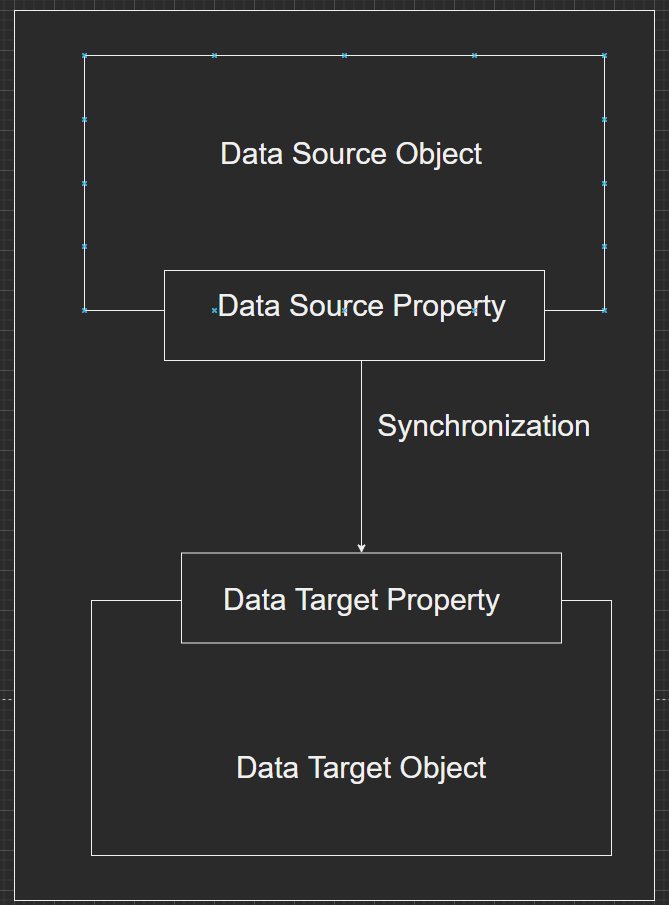
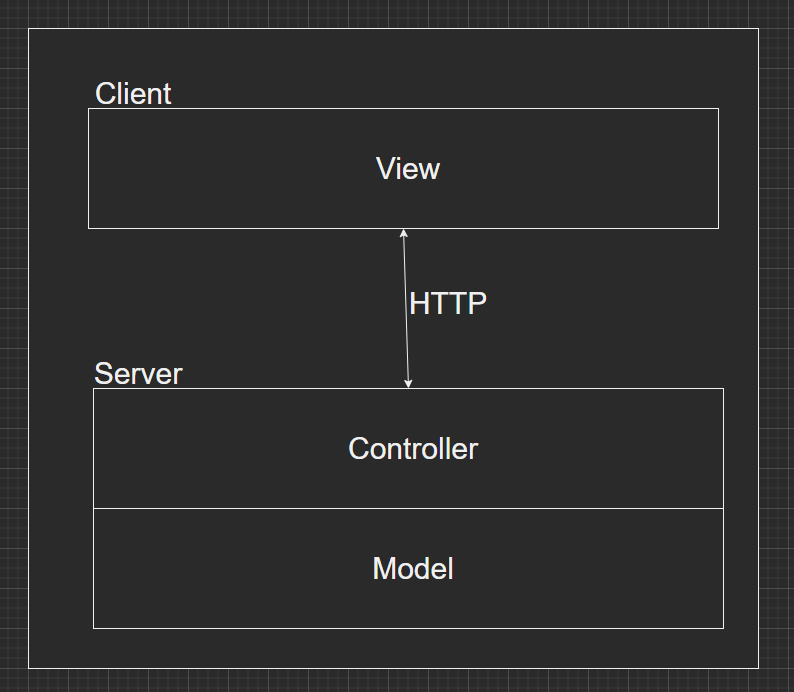
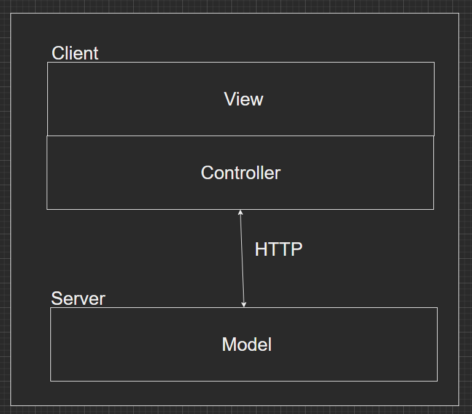
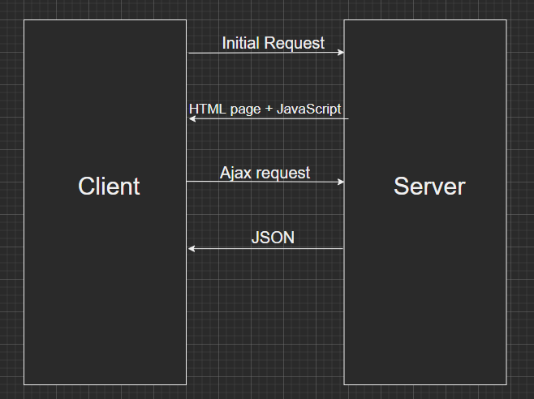

# Mastering JavaScript Object-Oriented Programming

## 1. A refresher of objects
## 2. Diving into OOP Principles
## 3. Working with Encapsulationg and Information Hiding
## 4. Inheriting and Creating Mixins
## 5. Defining Contracts with Duck Typing
## 6. Advanced Object Creation
## 7. Presenting Data to the User
## 8. Data Binding
## 9. Asynchronous Programming and Promises
## 10. Organizing Code
## 11. SOLID Principles
## 12. Modern Application Architectures

---

# 2. Diving into OOP Principles

## Association

Association is a relationship between two objects that are independent of each other. This means that an object can exist without the other.

Example:

```JavaScript
function Person(name, surname){
    this.name = name;
    this.surname = surname;
    this.parent = null;
}

const johnSmith = new Person("John", "Smith");
const fredSmith = new Person("Fred", "Smith");

fredSmith.parent = johnSmith;
```

## Aggregation

Aggregation is a special form of association where an object is more important than the other. The object with a more major role determines a sort of ownership but they can however, still exist without each other.

Example:

```JavaScript
const company = {
    name: "ACME Inc.",
    employees: []
};

function Person(name, surname){
    this.name = name;
    this.surname = surname;
    this.parent = null;
}

const johnSmith = new Person("John", "Smith");
const marioRossi = new Person("Mario", "Smith");

company.employees.push(johnSmith);
company.employees.push(marioRossi);
```

## Composition

Composition is a strong type of aggregation where the components can't live without each other.

Example:

```JavaScript
const person = {
    name: "John",
    surname: "John",
    address: {
        street: "TestStreet",
        city: "TestCity",
        country: "TestCountry",
    }
}
```

# 3. Working with Encapsulationg and Information Hiding

## Convetion-based approach information hiding

Just like in Python, the convention-based approach to build private members is by adding an underscore ```_``` in front of their names:

```JavaSCript
function Person(){
    this._personal_information = [];
}

Person.prototype.addPersonalInformation = function(personal_info) {
    this._personal_information.push(personal_info);
}
```

## Privacy levels using closure

Privacy can also be ensure by using closures:

```JavaScript
function Person() {
    const _personal_information = [];

    this.addPersonalInformation = function(personal_info) {
        this._personal_information.push(personal_info);
    }
}
```

## Privacy levels

We can classify members by privacy levels in the following way:

* Members that cannot be publicly accessed ( **private members** )
* Members that do not use private members and taht can be publicly accessed ( **public memebers** )
* Memebers that use private memebers and that can be publicly accessed ( **privileged members** )

This classification defines three **privacy levels** and it requires us to use different apporaches to implement them in a JavaScript object:

* A private member must be implemented as a local variable or function of the constructor.
* A public member must be implemented as a a memeber of ```this``` keyword, if it is a property, or as a memeber of the constructor's prototype, if it is a method.
* A privileged member must be implemented as a member of ```this``` keyword inside the constructor.

Here is some code that implements the three privacy levels:

```JavaScript
function TheatreSeats() {
    const seats = [];

    this.placePerson = function(person) {
        seats.push(person);
    }

    this.countOccupiedSeats = function() {
        return seats.length;
    }

    this.maxSize = 10;
}

TheatreSeats.prototype.isSoldOut = function() {
    return this.countOccupiedSeats() >= this.maxSize;
}

TheatreSeats.prototype.countFreeSeats = function() {
    return this.maxSize - this.countOccupiedSeats();
}
```

As we know, the ```seats``` variable is a private member, and it is not accessible from outside the constructor's closure. The ```placePerson()``` and ```countOccupiedSeats()``` methods are privileged members, since they can access the private variable ```seats```. The ```maxSize``` property and the ```isSoldOut()``` and ```countFreeSeats()``` methods are public members since they do not direclty access private members. However, they access the ```seats``` variable indirectly through the privileged methods.

## Benefits and drawbacks

```>```

Compared to the convention-based approach, the use of closure to define the three lvels of privacy is much more effective. It actually grants private data protection and exposes just what the developers need to access to use the object. However, this solution suffers from some flaws.

The first point is purely formal. Both privileged methods and priavte functions break the separation of concerns between the constructor and the instance prototype of an object. In fact, the constructor should be responsbile for data initialization of an object instance. The prototype should be responsible for general methods definitions and shared functionalities. By defining methods inside the constructor, we are giving it a responsibility for which it has not been designed.

Another drawback regard memeory consumption. By attaching a method to the prototype fo a constructor, we hsar ethe functionality among all instances created by the constructor. The prototype mechanism grants us just one copy of the method definition that exists in the application. Instaed, each privileged method definition is replicated for each object instance, unnecessarily increasing memory consumption.

In order to mitigate memory consumption, we can choose to define a minimum set of prvileged methods and to delegate to public methods those functionalities resulting from the composition of privileged methods. We used this approach for the ```isSoldOut()``` and ```countFreeSeats()``` methods definition. Altough this expedient allows us to reduce memory consumption, we will have some loss in performance due to indirect access to the constructor's closure as a counterpart.

## A meta-closure approach

The basic idea of the previous approach builds on the nature of closure. The constructor's environment is protected by default and remains accessible from the inside of the constructor itself even after it terminates. However, since the closure is created when the constructor is called, each object instance needs to have both private data and prvileged methods defined inside the constructor context. An ideal solution shoiuld be one that protects private data letting them be accessible from outside the constructor's closure. This should be a sort of ***meta-closure*** that offers an extra level of protection- a closure accessible from outside the object constructor by prototype members still hiding private data of the result object. this meta-closure can be built using an ***Immediately Invoked Funciton Expression ( IIFE ) ***.

## Creating a meta-closure with an IIFE

```JavaScript
const TheatreSeats = (
    () => {
        const seats = [];
        
        function TheatreSeatsConstructor(){
            this.maxSize = 10;
        }

        TheatreSeats.prototype.placePerson = function(person) {
            seats.push(person);
        }

        TheatreSeats.prototype.countOccupiedSeats = function() {
            return seats.length;
        }


        TheatreSeats.prototype.isSoldOut = function() {
            return this.countOccupiedSeats() >= this.maxSize;
        }

        TheatreSeats.prototype.countFreeSeats = function() {
            return this.maxSize - this.countOccupiedSeats();
        }

        return TheatreSeatsConstructor;
    }
());
```

The code ssigns the result of an IIFE to the ```TheatreSeats``` variable. The anonymous function declares in its local scope the ```setas``` array and the ```TheatreSeatsConstructor()``` constructor and attaches all methods to the prototype of the constructor. It the nreturns the constructor itself. As a result, the ```TheatreSeats``` variable will contain our final constructor.

# 4. Inheriting and Creating Mixins

## Implementing multiple inheritance

Just like we implement inheritance inside the constructor of a function, we can call the classes that we want to inherit from the same way:

```JavaScript
function Person(name, surname) {
    this.name = name;
    this.surname = surname;
}

function Developer(name, surname, knownLanguage) {
    Person.apply(this, arguments)
    this.knownLanguage = knownLanguage;
}

function Student(name, surname, subjectOfStudy) {
    Person.apply(this, arguments);
    this.subjectOfStudy = subjectOfStudy;
}

function DevStudent(name, surname, knownLanguage, subjectOfStudy) {
    Developer.call(this, name, surname, knownLanguage);
    Student.call(this, name, surname, subjectOfStudy);
}

const johnSmith = new DevStudent("John", "Smith", "C#", "JavaScript");

console.log(johnSmith.knownLanguage); // C#
console.log(johnSmith.subjectOfStudy); // JavaScript
```

In this example ```DevStudent``` is created by implementing multiple inheritance. We have inherited the 'classes' ```Developer``` and ```Student```.

```>```

This way to implemnet multiple inheritance is pretty simple, but may have some issues. What happens if two parent constructors have a member with the same name? We actually had such issues in our example, but we haven't worried about it. In fact, both ```Developer()``` and ```Student()``` constructors provide ```name``` and ```surname``` properties. When we invoked the parent constructors in ```DevStudent()``` function, the ```Student()``` constructor redefined ```name``` and ```surname``` derived from ```Developer()``` constructor. Since they have the same meaning, we have no side effect. But what happens if there is a name collision on members that have different meaning or behavior ? *If no action is taken, the last parent constructor will override any previous definition. So, tohe order of parent constructor calls matter when implementing multiple inheritance.*

```>```

## Creating and using mixins

The term ***mixin*** is usually used to specify a collection of functions available to be shared among objects or classes. It can be somehow considered similar to abstract calsses in classical OOP languages. Usually, the mixin functions are not direclty used, but they are *borrowed* to toher objects or calsses in order to exstend them without creating a strict relationship as it could be with inheritance.

## Mixing prototypes

Conisder our ```Person()``` constructor function in its minimal implementation:

```JavaScript
function Person(name, surname) {
    this.name = name;
    this.surname = surname;
}
```

Then consider a simple object literal implementing a ```getFullName()``` method that returns the full name based on the existing ```name``` and ```surname``` properties:

```JavaScript
const myMixin = {
    getFullName: function() {
        return this.name + " " + this.surname;
    }
}
```

This object is our mixin. It implements a generic function, not obund to a specific object constructor and available to be *mixed* with the memebers of other objects. I norder to enable the mixing of the members, we need a specific ufnction such as the following:

```JavaScript
function augment(destination, source) {
    for(const methodName in source) {
        if (source.hasOwnProperty(methodName)) {
            destination[methodName] = source[methodName];
        }
    }

    return destination;
}
```

The goal of this function os to add (or replace) methods of the object passed as second argument ot the object represented by the first argument. Often such function is named *extend*, but we rpefer to call it *augment* in order t oavoid confusion with inheritance extension.

***ECMAScript 6 introduced the method ```Object.assign()``` that has exactly the same bheavior of our ```augment()``` function. So, we may actually replace each occurrence of an ```augment()``` invocation with ```Object.assign()```.***

With this tool, we can easily add the member created by the ```Person()``` constructor:

```JavaScript
augment(Person.prototype, Mixin);
```

Now, when we will create a ```Person()``` instance, it will include the ```getFullName()``` method taken from the mixin:

```JavaScript
const johnSmith = new Person("John", "Smith");

console.log(johnSmith.getFullName());
```

Of course, we can add methods from different mixins and compose the public interface of our object as needed. For example, assuming that we have different mixins collection functionalities grouped by topic,w e can mix memebers with the following code:

```JavaScript
augment(Person.prototype, namingMixin);
augment(Person.prototype, movingMixin);
augment(Person.prototype, studyingMixin);
```

## Mixing classes

We can apply the mixin pattern based on prototype augmentation to classes as well. Let's consider, for example, the ```Person``` class definition:

```JavaScript
class Person {
    constructor(name, surname) {
        this.name = name;
        this.surname = surname;
    }
}
```

Since classes are equivalent to standard constructor functions, they can be extended with the ```augment()``` function or the ```Object.assign()``` method, as shown by the following code:

```JavaScript
augment(Person.prototype, myMixin);
```

Altough this approach is fully functional, a more consisten approach should be integrated with class syntax. To achieve this goal, we define a function that extends a generic class with our mixin:

```JavaScript
function mixNamingWith(superclass) {
    return class extends superclass {
        getFullName() {
            return this.name + " " + this.surname;
        }
    }
}
```

This function takes a class as argument and returns a subclass extended with our ```getFullName()``` method. This allows us to define a new class that includes methods from the mixin, as follows:

```JavaScript
class ExstendedPerson extends mixNamingWith(Person) { }

const johnSmith = new ExtendedPerson("John", "Smith");

console.log(johnSmith.getFullName());
```

If we need to compse a class from many mixin, we can make nested calls to mixin functions as shown here:

```JavaScript
class ExtendedPerson extends
    mixNamingWith(
        mixMovingWith(
            mixStudyingWith(
                Person
            )
        )
    ){
        // Code in here
    }
```

# 5. Defining Contracts with Duck Typing

## Duck typing

JavaScript neither has a native support of interface nor allows us to define new types. Moreover, it is an extremly dyanamic language that no only allows to create ojbects with specific memebers but also to change their structure at runtime so that we cannot make any assumptions based on instance type or other similar static information. However, we can try to define contracts using the so called ***duck typing***.

Duck typing is a programming technique where a contract is established between a function and its caller, requiring the parameters passed in by the caller to have specific members. David Thomas gave this curious name by this technique referring to the colloquial saying *"If it walk like a duck and qucks like a duck, it is a duck."*

Duck typing is not so much a type system as it is an approach to treaing objects as if they are certain types based on their behavior rather than their declared type. In other words, rather than checking if an object **is** a duck, we check if it **behaves like** a duck.

## Basic approach

The most ismple approach to implement duck typing is to check the presence of the requires members direclty in the method which needs the contract compliance.

```JavaScript
class SoftwareHouse {
  constructor(){
    this.employees = [];
  }

  hire(dev) {
    if ( dev && dev["writeCode"] && dev["writeCode"] instanceof Function) {
      this.employees.push(dev);
    }else {
      throw new Error("The argument does not implement writeCode method");
    }
  }
}
```

In a more readable and generic approach, we can define a private function that checks if an object implements a specific method:

```JavaScript
const SoftwareHouse = ( function() {
  function implementsMethod (obj, method) {
    return !!(obj && obj[method] && obj[method] instanceof Function);
  }

  function implementsProperty (obj, property) {
    return !!(obj && obj[property] && !obj[property] instanceof Function);
  }

  return class {
    constructor() {
      this.employees = [];
    }

    hire(dev) {
      if (implementsMethod(dev, "writeCode") && implementsProperty(dev, "name")) {
        this.employees.push(dev);
      } else {
        throw new Error("The argument is not compatible with the required interface");
      }
    }
  }
})();
```

## Emulating interfaces with duck typing

So far, we found a way as general as possible to check if an boject complies with a contract. Such solutions are not true interfaces as per classical OOP languages. In languages such as Java and c#, an interface is a syntactical entity that describes the members an object must implement to comply with a contract. Then, a class declares that it is implementing a specific interface and the type system checks if the declaration of the class actually does what it is saying. In JavaScript, we cannot rely on a mechanism like this, we have no sytnactical entity to declare interfaces nor a type system to check compliance. However, we can emulat einterfaces in some way letting the code look similar to classical OOP interfaces.

In order to obtain an interface-like approach, we define a class that emultes an interface declaration and check if an object implements it.

An example:

```JavaScript
class Interface {
  constructor(name, methods=[], properties=[]) {
    this.name = name;
    this.methods = [];
    this.properties = [];

    for(let i = 0, len = methods.length ; i < len ; i++) {
      if (typeof methods[i] !== 'string') {
        throw new Error("Interface constructor expects method names to be passed in as a string.");
      }

      this.methods.push(methods[i]);
    }

    for(let i = 0, len = properties.length; i < len; i++) {
      if (typeof properties[i] !== "string") {
        throw new Error("Interface constructor expects property names to be passed in as a string.");
      }

      this.properties.push(properties[i]);
    }
  }

  isImplementedBy(obj) {
    const methodsLen = this.methods.length;
    const propertiesLen = thos.properties.length;
    let currentMember;

    if(obj) {
      // Check methods
      for(let i = 0 ; i < methodsLen ; i++) {
        currentMember = this.methods[i];
        if(!obj[currentMember] || typeof obj[currentMember] !== "function") {
          throw new Error(`The object does not implement the interface ${this.name}. Method ${currentMember} not found.`);
        }
      }

      // Check properties

      for(let i = 0 ; i < propertiesLen; i++) {
        currentMember = this.properties[i];

        if(!obj[currentMember] || typeof obj[currentMember] === "function") {
          throw new Error(`The object does not implement the interface ${this.name}. Proeprty ${currentMember} not found.`)
        }
      }
    }else {
      throw new Error("No object to check!");
    }
  }
}
```

# 6. Advanced Object Creation

# The mysterious behavior of constructors

Usually, when we define a constructor, we do not specify a return value. The ```new``` operator causes the return of a new object instnace from the current value of ```this```. If we create a constructor returning a primitvate value, such as a string or a number, it will be ignored:

```JavaScript
function Person(name, surname) {
    this.name = name;
    this.surname = surname;

    return "This is a person";
}

const johnSmith = new Person("John", "Smith");

console.log(johnSmith.name);
console.log(johnSmith.surname);
```

In this example, the constructor returns a string, but we have no effect on the creation of a new object nor get any trace of the string returned by the constructor.

If our constructor returns an object, it will be returned and the object bound to the ```this``` keyword will be lost:

```JavaScript
function Person(name, surname){
    this.name = name;
    this.surname = surname;

    return {
        firstName: name, 
        secondName: surname
    };
}

const johnSmith = new Person("John", "Smith");

console.log(johnSmith.name);
console.log(johnSmith.surname);
console.log(johnSmith.firstName);
console.log(johnSmith.secondName);
```

## Singletons

With this constructor's behavior in mind, here is how we can build a Singleton in JavaScript:

```JavaScript
const IdGenerator = (
    () => {
        let instance;
        let counter = 0;

        const Constructor = function() {
            if(!instance) {
                instance = this;
            }

            return instance;
        };

        Constructor.prototype.newId = function(){
            return ++counter;
        };

        return Constructor;
    }
)();
```

# 7. Presenting Data to the User

## The user interface problems

The main reason for the complexity of UIs lies in the management of three aspects of the interaction between the user and the application: the **state**, the **logic** and the **synchronization**.

The **state** is the set of information that represents the current picture of the user interface. It determines what the user sees at a given time and how it can interact with the application.

The **logic** is the set of operaitons that can be done on the elements of an itnerface in order to show or hide data or to make validation. It may be very complex depending on the type of processing to be performed on the data presented to the user.

The **synchronization** concerns those activities that map data shown to the user with data represented by the business objects managed by the application.

The combination of these elements creates most of the complexity in the presentation of data to the user and the interaction with the application.

# 8. Data Binding

## What is data binding ?

In general terms, **data binding** is a way to bind data to one or more objects ensuring synchronization. For example, associating a model to a view or simply assigning the value of an object's property to another object's property by granting synchronization are forms of data binding. Usually, data binding is related to the mapping between a model and a user interface, but in general it may concern any synchronized mapping between objects.

## Data binding elements

In order to establish a data binding relationship between two objects, we need to define the following elements:

* **Data source object:** This is the object that represents  the data to be bound, for example, the Model in an MV* context
* **Data source property:** This is the property of the data source object that actually contains the data we want to bind
* **Data target object:** This is the object we want to associate the data to, typically the View in an MV* context
* **Data target property:** This is the property of the data targget object that actually is the recipient of the data to bind
* **Synchronization mechanism:** This is the specific apporach that allows us to asssign the value of the data source property to the data target property and keeps the two properties updated.



It is impotant to point out that the synchronization mechanism must update the data target property when a change to the data source property occurs. Its task is not a simple initial assignment of the two properties, but a constant alignment between the values of the two properties.

## Data binding directions

Beside the involved elements, an important feature in a data binding relationship is its direction, which is the data flow of a binding action. When we described the elements of the relationship, we implicitly set a direction from the data source property to the data target property. This means taht the value of the data source propety must be reflected on the data target property, not conversely. This is usually called ***one-way data binding***.

One-way data binding can be useful, for example, when we want to display some data on the screen and want that any changes on these data will be immediately updated on the screen.

A special case of one-way data binding is when a change on the data target property updated the data source property. It is the opposite behavior described for one-way data binding. Actually, it is still one-way data binding, but the syncrhonization mechanism is reversed; the data source property provides the initial value to the data targget property, but a change on the data target property determines the new value of the data source property. We will call it ***reverse one-way data binding***.

A typical context where revrse one-way data binding occurs is when we display the value of an object's property in a text box. Usually in this ocntext, we want that any changes on the textbox updated the object's property.

We can define a reverse relationship between the actors of a data binding relationship by swapping their roles. A data source object and its data source property become the data target object and data target property and vice versa. The two relationships are seen as one by calling it ***two-way data binding***. In this context, the synchronization mechanism must grant that when the value of any property involved in the data binding relationship changes the other property must be updated consistently.

## Manual data binding

The simplest way to set up a data binding relationship between two object is manual binding. 

HTML:

```HTML
<label>Name<input type="text" id="txtName"></label><br/>
<label>Surname<input type="text" id="txtSurname"></label><br/>
<button id="btnSave">Save</button>
```

It defines an HTML view with two text boxes and a save button. In our data binding model, the DOM elements that correspon to the two textboxes are the data target objects. Now, let's conisder the following code:

```JavaScript
function Person(name, surname) {
    this.name = name;
    this.surname = surname;
}

const person = new Person("John", "Smith");
```

The ```person``` object is the data source object for the data binding relationship we ware trying to set up. The initial binding between the data source object and the data target object can be simply done by the following code:

```JavaScript
const txtName = document.getElementById("txtName");
const txtSurname = document.getElementById("txtSurname");

txtName.value = person.name;
txtSurname.value = person.surname;
```

Now, we can define a reverse one-way data binding relationship using the click event on the save button:

```JavaScript
const btnSave = document.getElementById("btnSave");

btnSave.onclick = function() {
    person.name = txtName.value;
    person.surname = txtSurname.value;
}
```

With this approach, we defined a synchronization mechanisms that updates the data source properties when the user changes data on the web page.

## Data binding with proxies

We have seen hwo proxies can intercept accesses to the properties of an object in a transparent way. So, we will try to xploit it by implementing data binding.

Let's define a ```Binder``` class with a ```bindTo()``` method as in the following:

```JavaScript
class Binder {
    bindTo(dataSourceObject, dataSourceProperty, dataTargetObject, dataTargetProperty) {
        const bindHandler = {
            set: function(taget, property, newValue) {
                if (property == dataSourceProperty) {
                    target[dataSourceProperty] = newValue;
                    dataTargetObject[dataTargetProperty] = newValue;
                }
            }
        }

        return new Proxy(dataSourceObject, bindHandler);
    }
}
```

The ```bindTo()``` method defines a setter trap for the data source object so that each change to the specified property ```dataSourceProperty``` updates the associated property of the data target object. The ```bindTo()``` method returns the proxy created on the data source object, so we can use it as in the following example:

```JavaScript
const person = new Person("John", "Smith");
const txtName = document.getElementById("txtName");
const binder = new Binder();

const proxiedPerson = binder.bindTo(person, "name", txtName, "value");

setTimeout(
    () => {
        proxiedPerson.name = "New Name";
    },
    5000
)
```

We created a proxies version of the ```person``` object using the ```bindTo()``` mehtod by specifying the binding between the ```name``` property and the ```value``` property of the associated textbox. So each change on the name property of the ```proxiedPerson``` object reflects on both the ```name``` property of the ```person``` object and on the ```value``` property of the textbox.

This example takes into account only the property ```name```. If we want also to consider the ```surname``` property, we need to create a new proxy via the ```bindTo()``` method. Instead of creating a proxy for each property we want to bind, we can extend the ```bindTo()``` method to take a list of proeprties of the data source object to bind a list of pairs composed by the data target object and data target property. The following example shows the ```Binder``` class changed to support multiple bindings:

```JavaScript
class Binder {
    bindTo(dataSourceObject, dataSourceProperties, dataTargetList) {
        const bindHandler = {
            set: function(target, property, newValue) {
                const i = dataSourceProperties.indexOf(property);

                if ( i >= 0 ) {
                    target[dataSourceProperties[i]] = newValue;

                    dataTArgetList[i].obj[dataTargetList[i].prop] = newValue;
                }
            }
        }

        return bindHandler;
    }
}
```

In this class, the ```dataTargetList``` argument is an array of objects with two properties; the ```obj``` property stores the data target object and the ```prop``` property contains the data target property.

Example:

```JavaScript
const person = new Person("John", "Smith");
const txtName = document.getElementById("txtName");
const txtSurname = document.getElementById("txtSurname");
const binder = new Binder();

const proxiedPerson = binder.bindTo(
    person,
    ["name", "surname"],
    [
        {obj: txtName, prop: "value"},
        {obj: txtSurname, prop: "value"},
    ]
);

setTimeout(
    () => {
        proxiedPerson.name = "New Name";
    },
    5000
)
```

In addition to the proxy object, one of the JavaScript feature that generated interest in recent times is ***Object.observe()***, also known as ***O.o***. This method was intended to create a native Observer on an object and it should have been included in version 7 of ECMAScript. Some browsers such as Chrome and Opera already support it. However, the proposal has been withdarwn by the end of 2015.

# 12. Modern Application Architectures

## What is a large-scale application ?

Of course, an application requires a certain organization with respect to a collection of scripts. Indeed, while in most cases each script is limited to exercising its mission and possibly interacting with other scripts, an application requires a great coordination among the components, a centralized management feature such as error handling, logging and so on. This responsibility, along with others, becomes more evident when an application grows and becomes large.

But what exactly is a large-scale application ?

The answer to this question is quite subjective, since in most cases it depends on the experience on the single developer. Some people associate the size to the number of lines of code, others combine the number of features or components involved. In any case, it is difficult to give an objective definition of what actually is a very large application.

Addy Osmain said:

> Large-scale JavaScript apps are non-trivial applications requiring significant developer effort to maintain, where most heavy lifting of data manipulation and display falls to the browser.

## What is an application architecture ?

The architecture of an appliation is the definition of its strucutre and the design of the interactions between its components decided according to specific project goals. It is very important to note that an application's architecture is determined not only by its features, but also by the project's cross requirements, such as performance, extensibility, maintainability, secuiryt, reusability and so on. This means that there is no universal architecture, an architecture valid for any application. There are specific architectures for specific requirements. However, we have architectural patterns used in several common scenarios from which we can be inspired to choose a model for our application. As an example, the most common architectural patterns include the client/server architecture, the layered architecture, the service-oriented architecture, and so on. Of course, these are very general architectural patterns. More specific architectural patterns help us to strucutre our applications in a more targeted way.

## Goals of an architecture design

Usually, architecture decisions fro an application are among the most difficult aspects to modify over time and have long-term consequences on an application's life. For this reason, it is necessary to define the architecture of an application accurately and wisely, trying to balance the three categories of requirements that usually drive a software project:

* **User or customer requirements:** Generally, these features and their usability are to be implemented, but may include any other constraints explicitly declared by the customer or user.
* **Business requirements:** This cateogry includes requirements concerning the proejct's cost-effectiveness, both as per the first release and subsequent evolution and maintenance; some contraints such as access to specific features based on a license, fall also into this category of requirements.
* **System requirements:** These requirements are related to the hardware adn software platform on which the application will run and any constraints on deployment.

The satisfcation of these three categories of requirements must be taken into account when choosing a specific architecture for our application.

## Single Page Applications

With Ajax and the new dynamci nature of the DOM, that is the ability to manipulate it at runtime via JavaScript, a new understanding of a web application was born. No longer a collection of pages whose navigation depends on the server, but a set of views under JavaScript's control on the client - **Single Page Applications** or **SPA** were born.

Single Page Applications are able to redraw any part of the user interface without requiring a server round-trip to retrieve HTML. This is achieved by separating the data from its presenetation and usually applying some variant of MVC design pattern on the client. In fact, in the draditional approach to designing web applications, the client had the role of displaying the View and manage users interaction, while the server implemented the Controller and the Model, as depicted here:



In Single Page Applicatios, the View and the Controller are implemented into the client, while the server acts as the Model:

SinglePageApplicationArchitecture


## The server role

While in traditional web applications, the transition from one screen to another triggered the loading of a new HTML page from the server. In an SPA the server has no role in determining the screen transition. The client composes application views out of HTML templates and data, both of which it requewsts asynchronously as it needs them.

So, in the SPA model the server has no UI logic nor maintains any UI state. The role of the server consists in providing resources to the client, starting with the initial HTML for the single web page containing the entire application. The other resoursces are obtained in response to Ajax requests for data, represented usually by JSON data; but, they can be of different type such as HTML or even JavaScript code. The following picture describes the interactions between the client and the server:



## View composition

A Single Page Applicaiton is fully loaded in the initial page load and then dynamically updated with new HTML fragments composed by the client upon data loaded from the server. These fragments, usually called Views, make up what users commonly call screens or pages. A View can be aporition of the HTML page, such as a div or the entire screen. When a View occupies the entire screen, we call that page a reflect the fact that it completely draws the user's attention, but tehcnically it is just another view composed by the client.

We typically have many views in an SPA, and the resources needed to compsoe them are incrementally loaded from the server on demand. Since updating Views occurs asynchronously without reloading the entire page, Single Page Applications are more responsive and reduce network traffic  and optimize its latency.

## Navigation and routing

All modern SPA frameworks support the concept of routing. Routing is the ability to map URLs to Views so that users may navigate withint the application's UI. Usually, it is implemented through a service called **router**. The main task of a router is to define how a URL is mapped to a View and to perfrom the transition between Views in response to a click on some menu item or any user action. If the user has not seen the requested View before the, application may make an HTTP request to the server in order to retrieve the resources and dynamically compose the View Instead, if the View has already been viewed at least once, the browser may have cached it and the router willb e smart enough not to make the HTTP request to the server. This approach helps to reduce round-tripping to and from a server and imporve perceived performance.

## The remote data

A Single Page Application requests data over HTTP from a server. Usually, we think of data as strucutred information such as a list of values. From a SPA pont of view, data can be different kinds of information: JSON, HTML or any other resource that the application requires, even JavaScript code. In fact, an SPA can be designed so that its first load into the browser does not contain the netier application, but just the minimum code requires to start proerply. tEh rest of the code is dynamically loaded on demand during the user's navigation. Usually, JavaScript code is organized in modules loaded asynchronoulsy using an AMD loader.

In other words, the data that a SPA requires can be anything the application needs from the server in order to build its Views. So, maybe the term data is not so appropriate, and we should instead use th term resource.

## The Zakas/Osmani architecture

Although the SPA architecture defines the key elements on which a web application that is responsive and efficient should rely, it does not say exactly how to organize our code or how to interact with the components that make up a compelx application. We can say that the architecture of an SPA mainly propopses a model of interaction between client and server and suggests how to update the user interface, without saying how to organize the application's code.

An interesting architecture for large JavaScript applications is the one proposed by Nicholoas C. Zakas and Addy Osamani. In contrast to the SPA, the main architectural goal of Zakas and Osamni is to organize the code so that the resulting application is easily maintainable and scalable. The architectural focus is mainly on the basis of SOLID principles. However, it is not in opposition to Sinlge Page Applications, but it is neutral with respect to the navigation model and interaction with the server. Therefore, the Zakas/Osmani architecture can be adopted both for SPA and for traditional multipage applications. Indeed, we can say that this architecture can be considered valid also for language other than JavaScript, and for contexts different frmo the web.

### The overall architecture

The Zakas/Osmani architecture relies on a set of loosely coupled compoenents organized like this:


The proposed architecture contains a number of componenets each with a specific role and with a well-defined relatinoship between them. Each member knows little or nothing about the other components. The entire application is like a puzzle in which each piece has its own role but no one has an overall view of the final result. This is in line with the Single Reponsibility Principle, according to which a component must have one goal and one reason to change.

### The modules

A **module** is an autonomous funcitonal component and fully independent from the rest of the application. It contains both functional logic and portions of user interface and is focused on a single goal, according to the Single Responsibility Principle. We can think of it as a combination of JavaScript, HTML and CSS that can be displayed on a portion of the web page, roughly corresponding to a view in the SPA model. In contexts different from the web, we can imagine a module as a logical unit that provides functionality on a specific aspect of the business lgoic.

Do not confuse the concept of module in the architecture proposed by Zakas and Osmani with module intended as a mechanism to isolate and combine application code. Zakas used the term module to create an analogy with the modules that make up the international space station: independent elements created by different people in different places and assembled together to build an organic unit.

The modules are components that know how to do their own jobs well and do not know anything about the rest of the application. A series of rules define the context in which they can operate:

* They cannot directly interact with other modules
* They can only interact with the sandbox
* They can only access the DOM portion under its control
* They cannot create global objects

A module has its own life cycle dtetermined by the application core that decides when to create and destroy it. A module should be self-contained and independet from other modules in the application. It can fail and be removed without breaking the application. It can be chagned with another module that implements the same interface without breaking the application.

It is possible to create a base module from which other modules can inherit, but in this case, it is recommended to keep the inheritance chan very short. A module should be very light and have as little dependency as possible The lower the dependecy between modules, the greater the flexibility and maintainability.

### The Sandbox

We discussed the fact that a module is a self-contained unit and cannot directly communicate with other modules. The only way to communicate with the rest of the application si to use the Sandbox. The **Sandbox** is a layer that exposes a common API to interact with the other components of the appliation. It has the role of keeping the modules loosely coupled. In fact, by limiting the dependency of each module to a single component, it is easier to remove or replace a module in the application architecture. In addition, the Sandbox can carry out safety checks on the interaction requrests toward the rest of the application, preventing unauthorized activities.

It is possible to create a specific Sandbox for each module or one Sandbox shared among all modules. This is an architectural choice that may depend on the degree of complexity of the internal API of the application. What all the Sandboxes must provide is standard API for common tasks that a module can perform, such as:

* The communication with other modules
* The execution of Ajax requests
* Access to the DOM
* The association and disassociation of event handlers

The key thing to keep in mind is that a Sandbox does not implement any of the preceding features. It is simply an interface to the features implemented by the application core. The existence of this level in the architecdture proposed by Zakas and Osmani ensure a decoupling between the implementation of internal services and the interface exposed to the modules, thus promoting an evoultion of the application without upheavals. A typical Design Pattern to implement the Sandbox is the facade pattern.

### The application core

The **application core** is the central part of the application. It is the only global object in the entire application and includes in tits basic tasks:

* Allowing registration of the modules
* Managing the life cycle of the modules
* Managing the communication between the modules
* Managing the interaction with the base library
* Handling errors

The application core should not be contacted direclty by the moduels, but only through the Sandbox. The Sandbox must be the only component able to contact the application core and it must be the only component able to interact wit hthe base library. Keeping these components separat enable us to easily swap out just one component with minimal impact on the others.

The application core has to be designed for extensibility so that it should be easy to add new features and extend existing ones with little effort. This ensures the evolution of the application and its maintainability.

### The base library

The bottom layer of the Zakas/Osmani archtiecture is the base library. This is the layer on which the entire application is built and provides general functionalities, independent from the specific application, such as:

* DOM manipulation
* Data serialization and deserialization
* Ajax communication
* Browser normalization and abstraction

These features can be provided by a custom or a standard library .The important point is that only the application core knows which libraries are being used and their replacement has an impact only on it and not on the rest of the application.

## Isomorphic applications

One o fthe latest proposals as part of the possible architecture for JS application are the so-called **isomorphic applications**. The basic idea is to exploit the ability to execute JS code both on server side and client side, being able to obtain benefits both in terms of performacne and code reuse.

In the SPA architecture, the initial request from the browser causes teh download of the JS application before it can berendered in the first screen .The waiting time may be long dpeending on the size of the application, its complexity, the computing capactiy of the device and the speed of the network conneciton. The isomorphic applications intend to overcome these limitations by proposing a hybrid approach between traditional web applications and SPAs.

The ability to run the same applicatiion on both the server and the client offers new scenarios:

* The server can immediately send the rendering of the first page of the application, while in the background the client can download the entire appliacation, optimizing the initial load time.
* The server can send the result of page rendering as in traditional web applications, according to the type of client, such as clients that do not have sufficient computing resources or web crawler for SEO optimizations.
* We can also simply share libraries used in both server-side an client-side processing.

Of course, this scenario brings nwe technical challenges, such as the uniform management of the routing on the server and on the client or the HTML markup rendering even without a DOM, as it happens on the server. For the management of these aspects ad hoc framework, such as Meteor or Rendr, should be exploited.